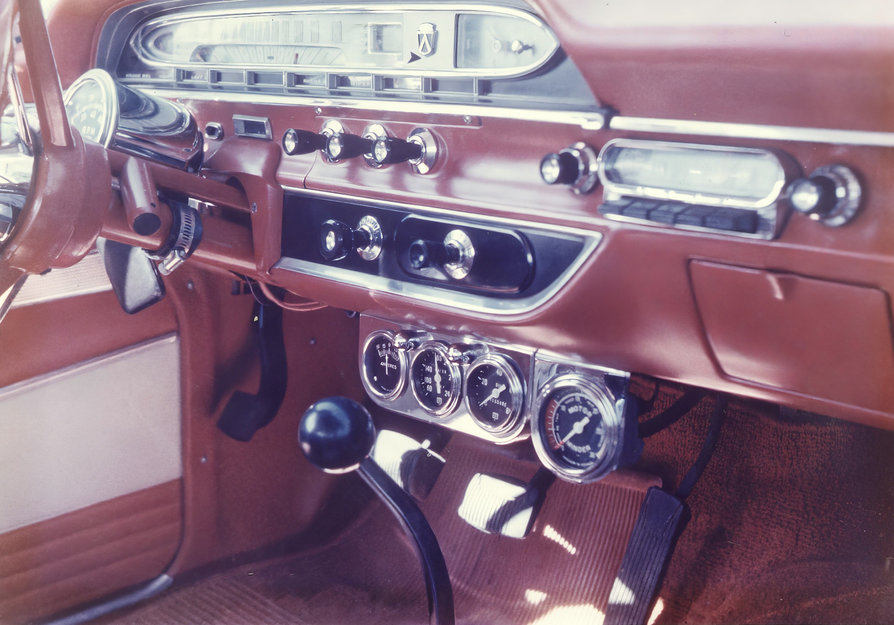
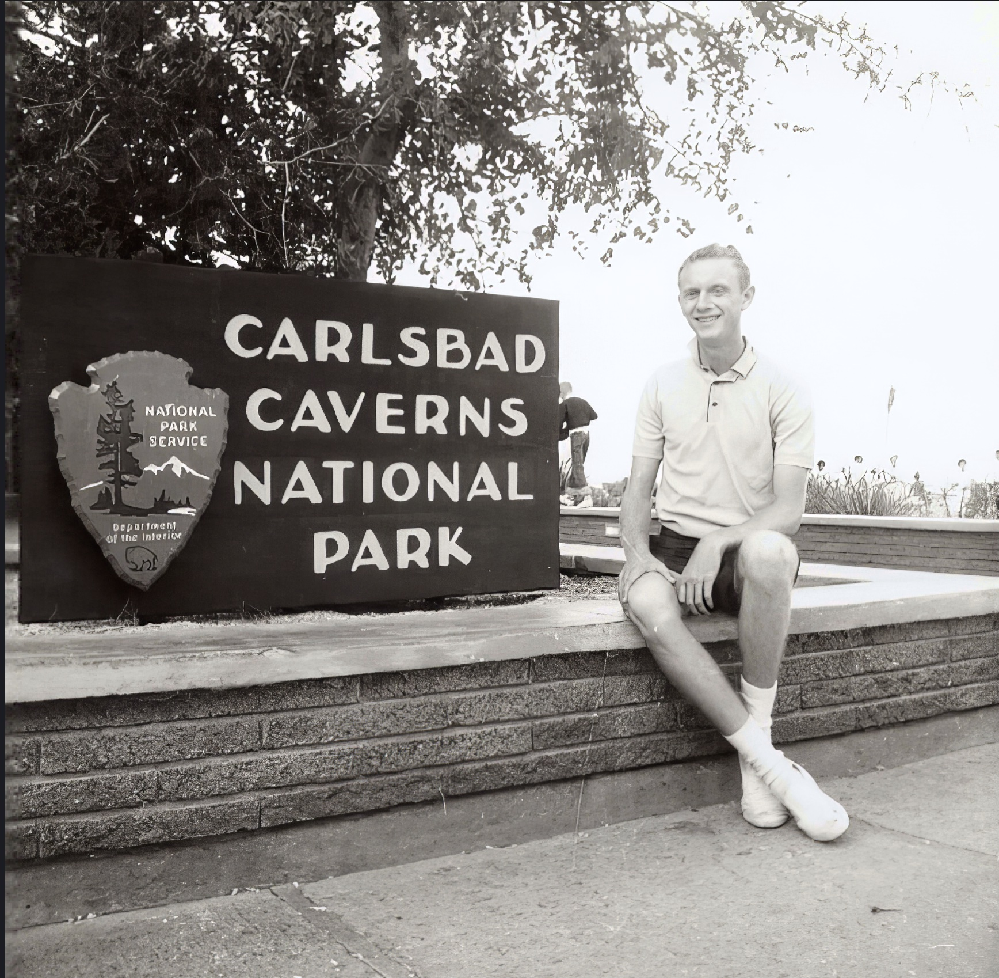
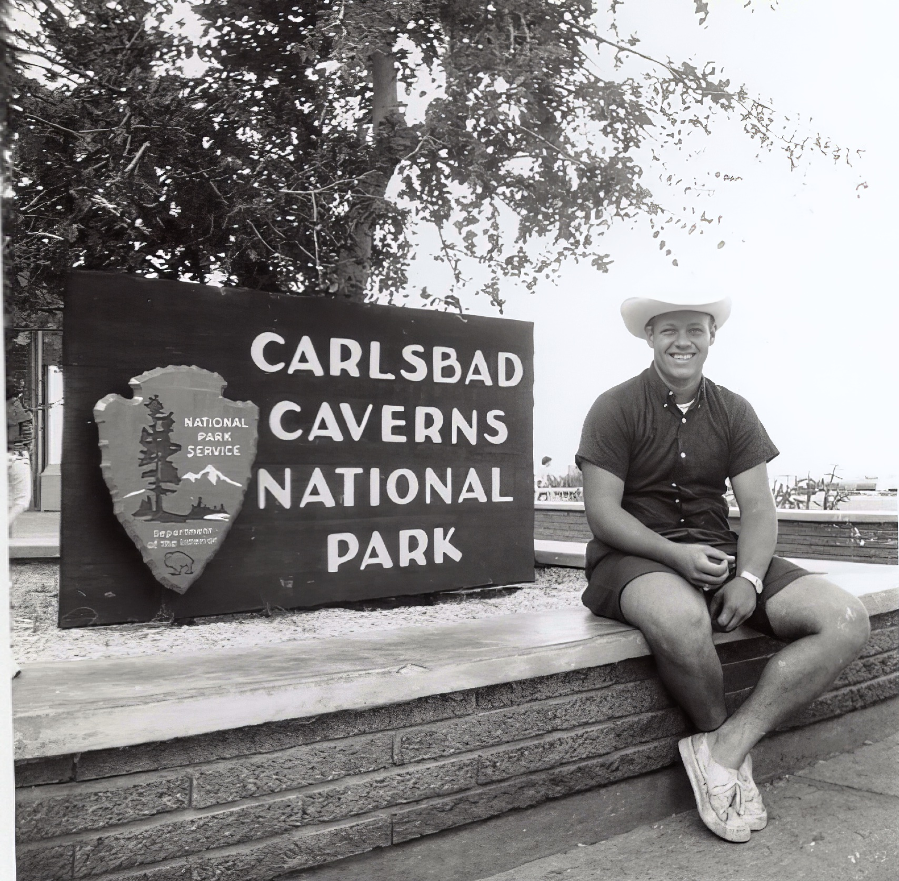
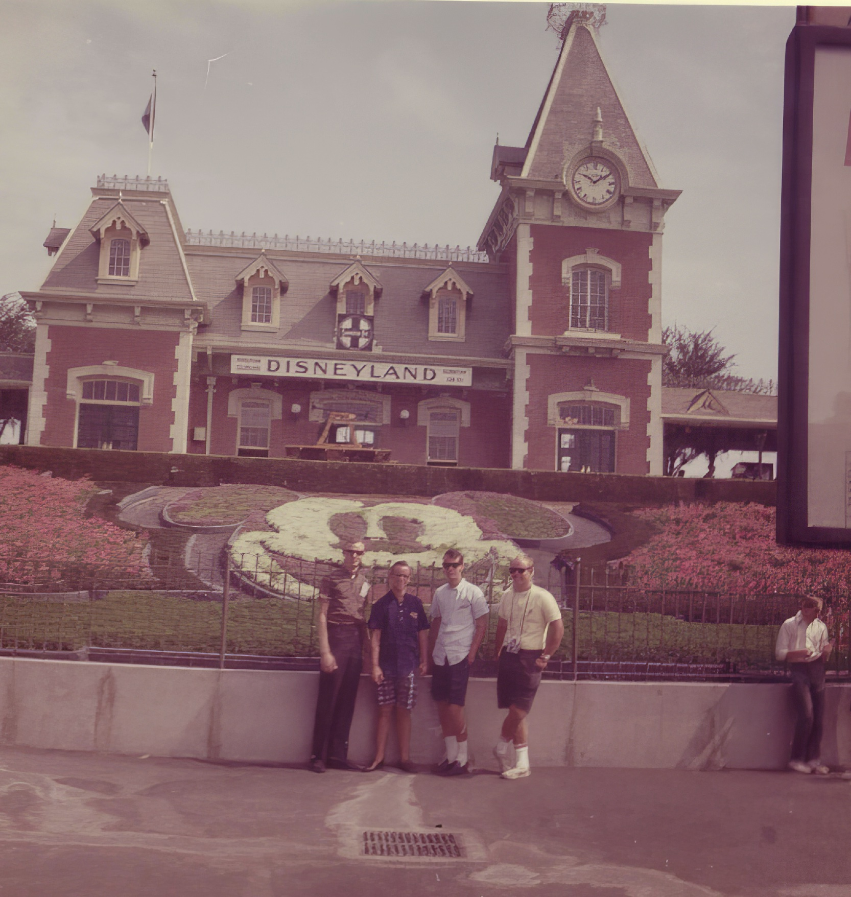

## Cross-country with Barry

When we graduated from high school, four of us celebrated by taking
a 21-day trip across the US.

My friend Barry Connor organized the trip. He drove the entire trip,
sometimes covering over 700 miles in a single day. We took his red
1961 Ford Starliner with a 390 cubic inch big block V-8 that he
sometimes raced at Tampa Dragway.

Our trip was written up in the local newspaper after we returned. I
scanned the article and converted it into a text file since the
scanned image was difficult to read.

## On the road

**By EARL WELLS 
Tribune Staff Writer**

**LAKELAND**----Four adventuresome Lakeland youths returned this week
from an 8,021-mile, 21-day trip that took them west to the gleaming
Pacific, north to the frozen Colorado Rockies and then home through
the Kansas wheat fields.

**Except for a few innocent, but harrowing experiences, the quartet
is ready to go again, but "to a different section of the country."**

Barry Connor. Terry Douglass, Monty Williams and Joel Adamson, 1963
graduates of Lakeland High School, departed July 24 on the trip
which had been in the planning stages for a year.

*  *  *

**LOADED WITH** $200 each in travelers checks, the "Happy Wanderers"
set their sights on Los Angeles, Calif., with stops at selected
spots in be tween. On setting out, $60 from each boy was allocated
to the "auto kitty." From this gasoline was purchased, the car was
serviced and admission was paid to national parks and camping sites.

At the end of the first day on the road, the boys found themselves
in Mobile, Ala. They lodged in a dilapidated YMCA, "but it was
cheap." somebody remarked.

**A three-hour tour of New Orleans, including the French Quarter and
Bourbon Street highlighted the second day. Stunned by aggressive
club owners in the French section, one of the youths said, "They
actually pull you in off the streets."**

Except for a closed circuit TV peek into the Playboy Club, "we
minded our manners," they said.

*  *  *

**DEPARTING** from the bayou country, the venturesome foursome pushed
their '61 Ford hard, covering over 700 miles before stopping at Ft.
Stockton, Tex., where they camped out for the first time. "Darn
near froze to death, too," Barry confided.

**Carlsbad Caverns provided one of the most interesting experiences
of the trip the following day. Late in the evening spirits were
lifted when they met mutual friends of Lakeland residents at a
dance. Roadside camping was in order for the night.**

Two more days and the red prairie schooner had crossed the Painted
Desert, Petrified Forest, Grand Canyon and finally to the city with
millions of flickering, beckoning lights, Las Vegas, Nev.

**"We really lived it up there" the quartet agreed. Registered at the
plush Tropicana Hotel with a "Folies Bergere" floor show and Jerry
Colonna in the spotlight, they surmised "Lakeland was never like
this."**

Strict law enforcement of the legal gambling age of 21 prohibited
the boys from testing their skills against the famed one-armed
bandits. And a $37 dinner check stymied them, but only temporarily.

*  *  *

**AFTER** a day and a half in the gambler's paradise, South Los Angeles
and Disneyland were next on the map. A full day was spent in the
world of make-believe created by the master of showmen.

**"We were amazed at the cleanliness of Disneyland," Terry said.
"Cleanup men are stationed everywhere and the streets are spotless."**

California's beaches caught the boys' eyes following Disneyland.
However, except for excellent surfing provided by the large waves,
their beaches are not superior to those in Florida, the boys said.

While camping in a field near the beach, they found themselves in
a precarious spot for the first time. Local police questioned their
presence, but after a lengthy explanation they were given clean
bill.

*  *  *

**THE NEXT DAY** wasn't much better. Efforts to get across the border
into Tijuana, Mexico, were fruitless, since all of the boys were
under 21.

**In fact, the San Diego police had no welcome mat for the visitors.
They were accused of running away from home, seeking refuge south
of the border.**

Thwarted in their border crossing attempt, the boys followed the
compass north through Los Angeles and into Hollywood. "It's
unbelievable," they said. Barry snapped a picture of Hollywood and
Vine "just to prove we've been there." And the "freeways; "Wild
man, wild."

*  *  *

**THE BIGGEST SCARE** of the trip occurred south of San Francisco the
following night. Having completed the weekly laundry chore, Monty,
garbed in a sweat-shirt with matching hood and muffle, was mistaken
for a holdup man by an over-alert house-wife.

**Her ensuing phone call brought four carloads of police, and a brace
of detectives. Armed with sawed-off shotguns, police dogs and riot
weapons, the boys were forced to "hold up our hands" while being
frisked by the nervous officers.**

They were Soon released however and told by an officer: "It's against
the law to wear a mask in California."

"We didn't wear that hood any more on the entire trip, they said.

*  *  *

**CROSSING** the Golden Gate in heavy fog. Yosemite National Park loomed
ahead.  There the boys engaged in a snowball fight, the first for
two of them.

**Then on across the sparsely settled state of Nevada, and onto the
Bonneville salt flats.  The boys were fortunate to see the record
setting "Spirit of America" just a few days after the mark fell.**

Southern Idaho brought the first and only auto difficulty. It cost
$6.50 for a fuel filter and they were on their way to Yellowstone
National Park, witnessing Old Faithful in her regal splendor.

*  *  *

**ROCKY MOUNTAIN** National Park and the little community of Lakeland,
Colo. were next, followed by Hoover Dam and the United States Mint
at Denver. A quick tour of the USAF Academy at Colorado Springs and
a view into the Royal Gorge preceded the turn southward and the
start home.

Amazing as it may seem the boys had only one minor case of auto
trouble, added no water to the car radiator and came home with money
in their pockets. They did no cooking, ate in restaurants over the
entire trip, munching hamburgers one day and relishing steak the
next.

## Photos

### Barry's 1961 Ford Skyliner

 

### Carlsbad

### Petrified Forest

### After a long day

### Grand Canyon

### Disneyland

### Snow

